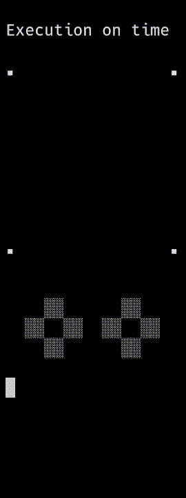
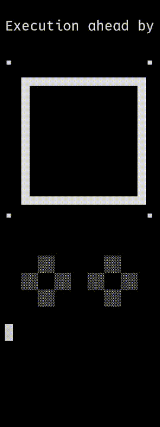
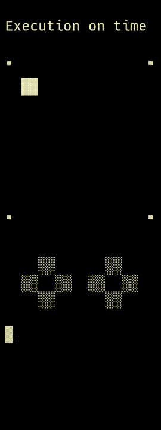
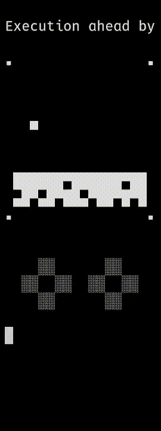
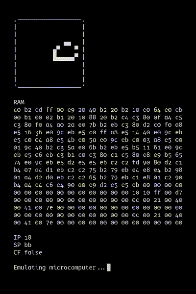

# Atto-8

_A minimalist 8-bit microcomputer with stack-based microprocessor_

## Overview

The Atto-8 is a small ecosystem of hardware and software living in symbiosis. The [Atto-8 microcomputer](spec/microcomputer.md) is a minimalist computer system based on the [Atto-8 microprocessor](spec/microprocessor.md), which is a stack-based processor implementing the [Atto-8 microarchitecture](spec/microarchitecture.md). Repository structure is as follows:

- [/spec/](spec/) &mdash; Specification for Atto-8 microarchitecture, microprocessor and microcomputer
- [/lib/](lib/) &mdash; Assembly standard library for Atto-8 microcomputer
- [/libc/](libc/) &mdash; C standard library for Atto-8 microcomputer
- [/cc/](cc/) &mdash; Rudimentary C99 compiler for Atto-8 microarchitecture
- [/enc/](enc/) &mdash; Hex-to-opcode encoder for Atto-8 microarchitecture
- [/dec/](dec/) &mdash; Opcode-to-hex decoder for Atto-8 microarchitecture
- [/asm/](asm/) &mdash; Optimizing assembler for Atto-8 microarchitecture
- [/dasm/](dasm/) &mdash; Elementary disassembler for Atto-8 microarchitecture
- [/emu/](emu/) &mdash; Instruction-level emulator for Atto-8 microcomputer
- [/mic/](mic/) &mdash; Microcode builder for Atto-8 microprocessor
- [/sim/](sim/) &mdash; Cycle-accurate component-level simulator for Atto-8 microcomputer
- [/circ/](circ/) &mdash; Gate-level circuit design for Atto-8 microcomputer
- [/bf/](bf/) &mdash; Brainfuck architecture frontend for Atto-8 microprocessor
- [/test/](test/) &mdash; Test programs and test framework for Atto-8 microcomputer
- [/misc/](misc/) &mdash; Miscellaneous files

## Project Status

This project is a work in progress. Try it out by running any of the following commands from the [/test/](test/) directory:

```bash
# demo programs
python3 test.py draw.asm asm emu
python3 test.py random.asm asm emu
python3 test.py counter.asm asm emu
python3 test.py slideshow.asm asm emu
python3 test.py bad\ apple.asm asm emu
python3 test.py brainfuck.asm asm emu
python3 test.py run-length.asm asm emu
python3 test.py attomon.asm asm emu
python3 test.py flappy.asm asm emu
python3 test.py snake.asm asm emu
python3 test.py circle.asm asm emu
python3 test.py life.asm asm emu
python3 test.py dino.asm asm emu
python3 test.py 2048.asm asm emu
python3 test.py plane.asm asm emu
python3 test.py pong.asm asm emu
python3 test.py ctf.asm asm emu
python3 test.py fade.asm asm emu
python3 test.py calc.asm asm emu
python3 test.py pixedit.asm asm emu
python3 test.py stopwatch.asm asm emu
python3 test.py mandelbrot.asm asm emu
python3 test.py mock\ shell.asm asm emu
python3 test.py bell\ pattern.asm asm emu
python3 test.py color\ maze.asm asm emu
python3 test.py char\ code.asm asm emu
python3 test.py grayscale.asm asm emu
python3 test.py fibonacci.asm asm emu
python3 test.py fizzbuzz.asm asm emu
python3 test.py rule\ 110.asm asm emu
python3 test.py collatz.asm asm emu
python3 test.py reverse.asm asm emu
python3 test.py hanoi.asm asm emu
python3 test.py rot13.asm asm emu
python3 test.py simon.asm asm emu
python3 test.py tetris.asm asm emu
python3 test.py doom.asm asm emu

# test programs
python3 test.py printf.asm asm emu
python3 test.py sorting.asm asm emu
python3 test.py strings.asm asm emu
python3 test.py allocation.asm asm emu
python3 test.py hello\ world.asm asm emu
python3 test.py multiplication.asm asm emu
python3 test.py addition.hex enc emu
python3 test.py checkerboard.hex enc emu
python3 test.py pipe.c libc/stdio.c libc/crt0.c cc asm emu
python3 test.py hello\ world.c libc/stdio.c libc/crt0.c cc asm emu
python3 test.py test.c libc/string.c libc/stdlib.c libc/stdio.c libc/crt0.c cc asm emu
python3 test.py fibonacci.c libc/stdlib.c libc/stdio.c libc/crt0.c cc asm emu
python3 test.py printf.c libc/stdlib.c libc/stdio.c libc/crt0.c cc asm emu
python3 test.py hanoi.c libc/stdlib.c libc/stdio.c libc/crt0.c cc asm emu
python3 test.py errors.asm asm emu
```

     
