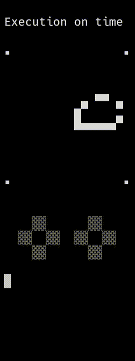

# Atto-8

_A minimalist 8-bit microcomputer with stack-based microprocessor_

## Repository Structure

- [/spec/](spec/) &mdash; Specification for Atto-8 microprocessor and microcomputer
- [/lib/](lib/) &mdash; Assembly standard library for Atto-8 microprocessor and microcomputer
- [/enc/](enc/) &mdash; Hex-to-machine-code encoder for Atto-8 microprocessor
- [/asm/](asm/) &mdash; Optimizing assembler for Atto-8 microprocessor
- [/dasm/](dasm/) &mdash; Elementary disassembler for Atto-8 microprocessor
- [/emu/](emu/) &mdash; Instruction-level emulator for Atto-8 microcomputer
- [/mic/](mic/) &mdash; Microcode compiler for Atto-8 microprocessor
- [/sim/](sim/) &mdash; Cycle-accurate simulator for Atto-8 microcomputer
- [/test/](test/) &mdash; Test programs and test framework for Atto-8 microcomputer
- [/misc/](misc/) &mdash; Miscellaneous files

## Project Status

This project is a [work in progress](TODO.md). Try it out by running any of the following commands from the [/test/](test/) directory:

```bash
# completed programs
python3 test.py draw.asm asm emu
python3 test.py random.asm asm emu
python3 test.py hllowrld.asm asm emu
python3 test.py counter.asm asm emu
python3 test.py mushroom.asm asm emu
python3 test.py bad\ apple.asm asm emu
python3 test.py attomon.asm asm emu
python3 test.py flappy.asm asm emu
python3 test.py circle.asm asm emu
python3 test.py life.asm asm emu
python3 test.py dino.asm asm emu
python3 test.py ctf.asm asm emu
python3 test.py fade.asm asm emu

# incomplete programs
python3 test.py pong.asm asm emu
python3 test.py snake.asm asm emu
python3 test.py mandelbrot.asm asm emu

# test programs
python3 test.py ore.asm asm emu
python3 test.py allocation.asm asm emu
python3 test.py optimization.asm asm emu
python3 test.py multiplication.asm asm emu
python3 test.py nop.hex enc emu
python3 test.py addition.hex enc emu
python3 test.py checkerboard.hex enc emu
python3 test.py errors.asm asm emu
```

   
